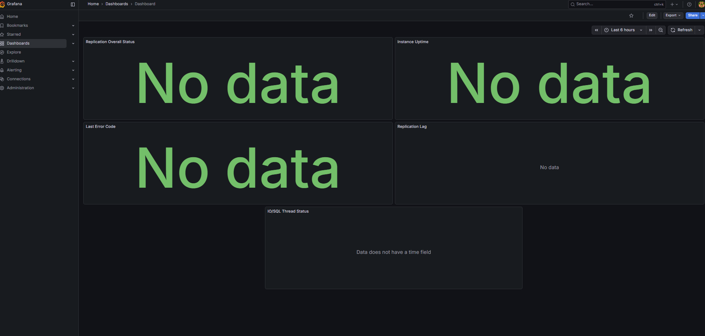

I used the same Minikube cluster for this task. I used Helm to deploy Grafana and Prometheus to the cluster. I think it's the most convenient way to do that.

Firstly, I analyzed the provided alert:

```
expr: mysql_slave_status_slave_io_running == 0 or mysql_slave_status_slave_sql_running == 0
```

This alert should be important for any MySQL setup. Per my check, it monitors the two threads responsible for replication. IO threads connects to the master and reads the log, and the SQL thread executes the events on the slave.

The alert fires if either of these threads stops working for more than 2 minutes.

---

So, I created 5 panels in my Grafana dashboard:

- Replication Overall Status. 

    If the sum of running threads is less than 2, it turns red.

- IO/SQL Thread Status. 
    
    To see exactly which component failed.

- Replication Lag. 

    To understand how stale the data is.

- Last Error Code. 

    Shows the MySQL error code to speed up debugging.

- Instance Uptime. 

    We can check if the issue was caused by a database restart.



The panels show no data for now as there is no actual database, but the PromQL queries are configured.

---

The alert monitors both the IO and SQL threads, so there can be several possible issues. If the IO thread is down, I assume it’s a network issue or simply that the Master is unreachable. If the SQL thread is down, I think the replication is connected but cannot apply the data. Per my investigation, it could be due to data inconsistency, like when the slave tries to insert a record that already exists.

To fix this, I think we shouldn't rely only on the alert. I may connect to the database pod and check the error message there. If it's a connectivity error, I would check the network configurations or credentials. If it's some data error, we might need to fix the data on the slave to match the master. Once it's resolved, I think we just need to restart the replication threads to get everything healthy again.
